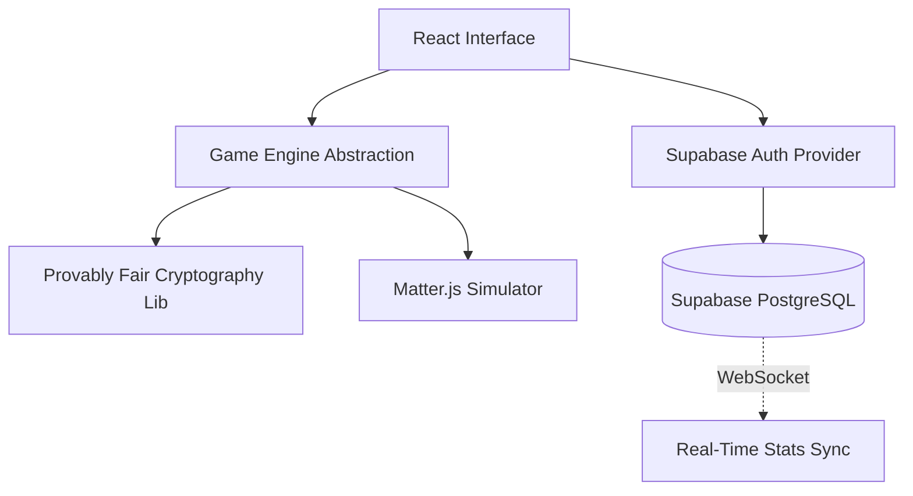

<div align="center">
  
</div>

<h1 align="center">React Casino Gaming Platform & Simulator</h1>

<div align="center">
  <p><strong>A full-stack, provably-fair Web3-style gaming platform built with React, TypeScript, Supabase Realtime, and Matter.js.</strong></p>
  
  <p>
    <a href="https://tapiwamakandigona.github.io/zimbet/"></a>
    
    
  </p>
</div>

---

## ⚡ Why This Repository Exists

If you are looking for an open-source architecture demonstrating **complex State Management in React**, **Real-time WebSockets via Supabase**, and **Physics-based HTML5 UI rendering**, this is the benchmark. ZimBet is a production-grade simulation of a modern online casino, implementing identical cryptographic "Provably Fair" algorithms used by tier-one platforms like Stake or Roobet.

<br/>

## 🎲 The Games (Provably Fair)

| Game Engine | Technical Implementation | Mechanics |
|------|-------------|-----|
| **Aviator (Crash)** | Real-time exponential multiplier scaling on `requestAnimationFrame` | Cash out before the server crashes the multiplier. |
| **Plinko** | Native HTML5 Canvas + `Matter.js` rigid body physics | Drop the ball through collision pegs to hit multipliers. |
| **Mines** | Grid-state matrix with cryptographic hashing | Avoid the mines. The risk-to-reward ratio scales dynamically. |
| **Coinflip** | True RNG boolean simulation | Heads or tails variant. |
| **Dice** | Float generation (0-100) with client-side slider state | User-defined probability vs. payout calculations. |
| **Wheel** | CSS variables + mathematical rotation interpolations | Spin to win defined multiplier segments. |

---

## 🛠️ Core Technology Stack

- **Frontend:** React 19, TypeScript, React Router 7
- **Backend & Auth:** Supabase (PostgreSQL), JWT Authentication
- **Real-Time Data:** Supabase Subscriptions (Live Player Leaderboards)
- **Physics Engine:** Matter.js (2D rigid body physics for Plinko)
- **Build Tooling:** Vite, ESLint, TypeScript Compiler
- **Hosting:** GitHub Pages CI/CD Deployment Action

---

## 🏗️ System Architecture

Our platform strictly adheres to a modular, feature-based architecture to isolate game logic from the React UI lifecycle layer.



---

## 🚀 Quick Start / Local Setup

Want to run this casino locally? It's fully container-ready. 

**1. Clone the repository**
```bash
git clone https://github.com/tapiwamakandigona/zimbet.git
cd zimbet
```

**2. Install Dependencies**
```bash
npm ci
```

**3. Database Configuration**
Execute the provided schema inside your Supabase SQL editor:
`./SUPABASE_SETUP.sql`

**4. Run the Development Server**
```bash
npm run dev
```

---

## 🛡️ Security & Anti-Cheat

ZimBet enforces strict separation of concerns. While the UI visually represents game state, the underlying mathematical engines calculate loss/win scenarios independently to prevent client-side DOM manipulation or React Developer Tools hacking.

*See [SECURITY.md](SECURITY.md) for full anti-cheat methodologies.*

---

<div align="center">
  <b>Built by <a href="https://github.com/tapiwamakandigona">Tapiwa Makandigona</a></b>
  <br/>
  <i>If you found this architecture helpful, please give it a ⭐ to help others find it!</i>
</div>
